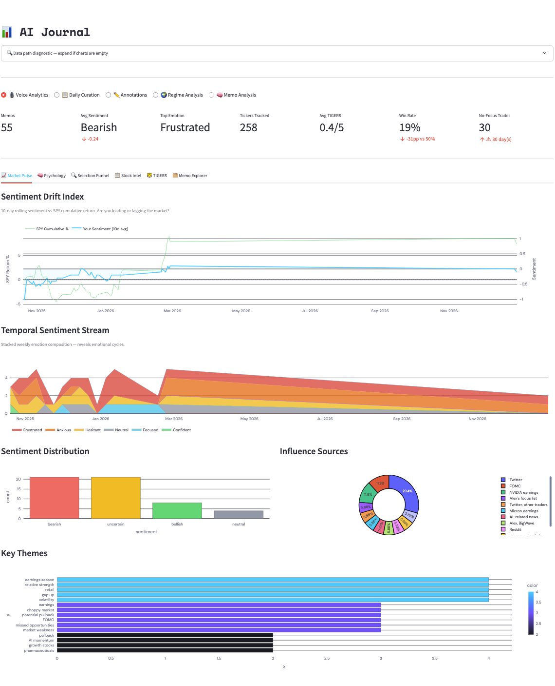
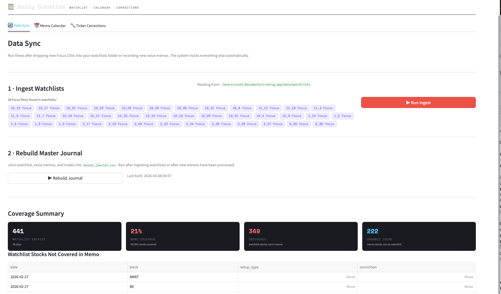
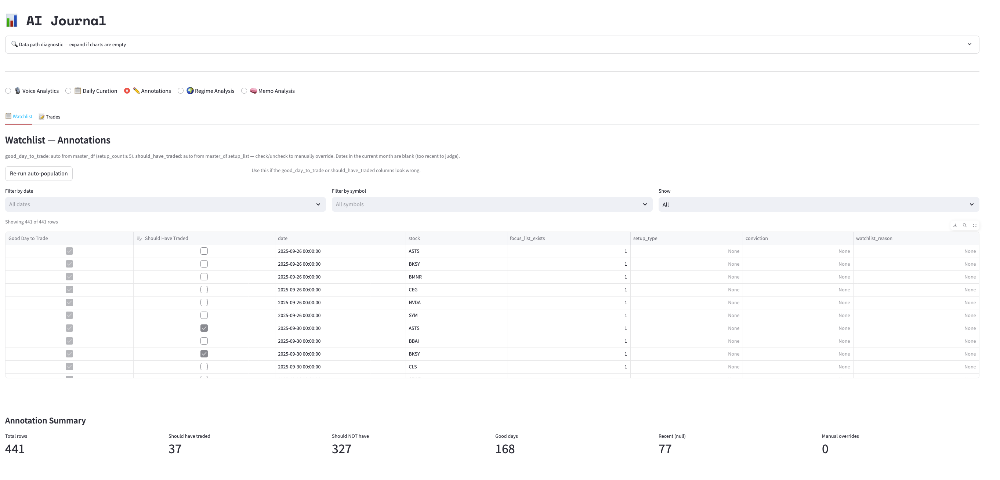
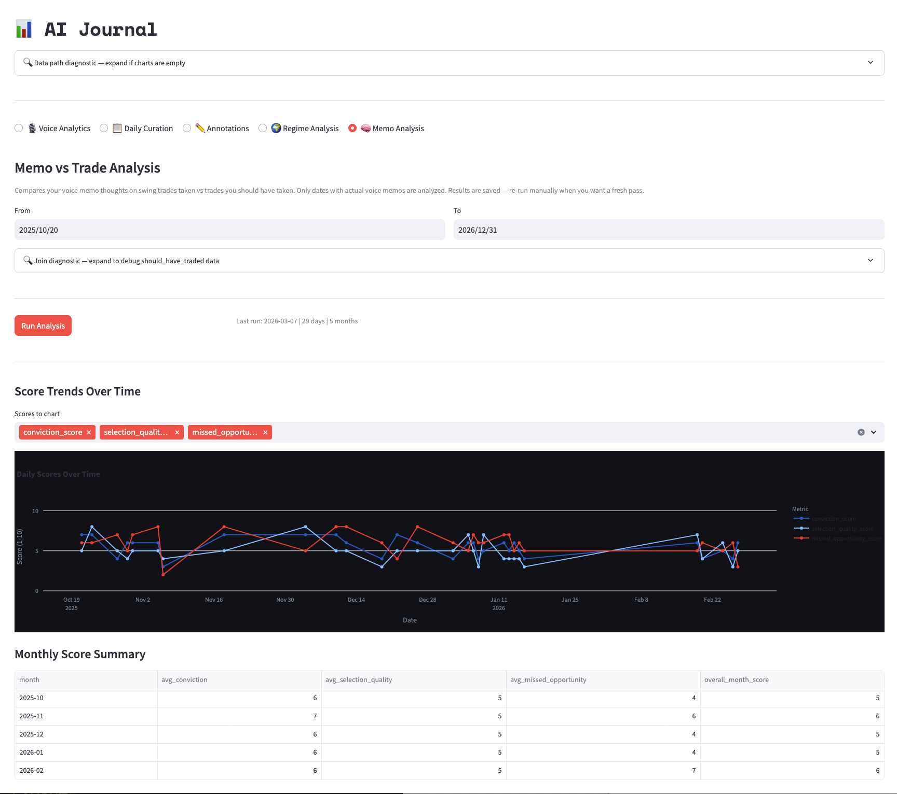
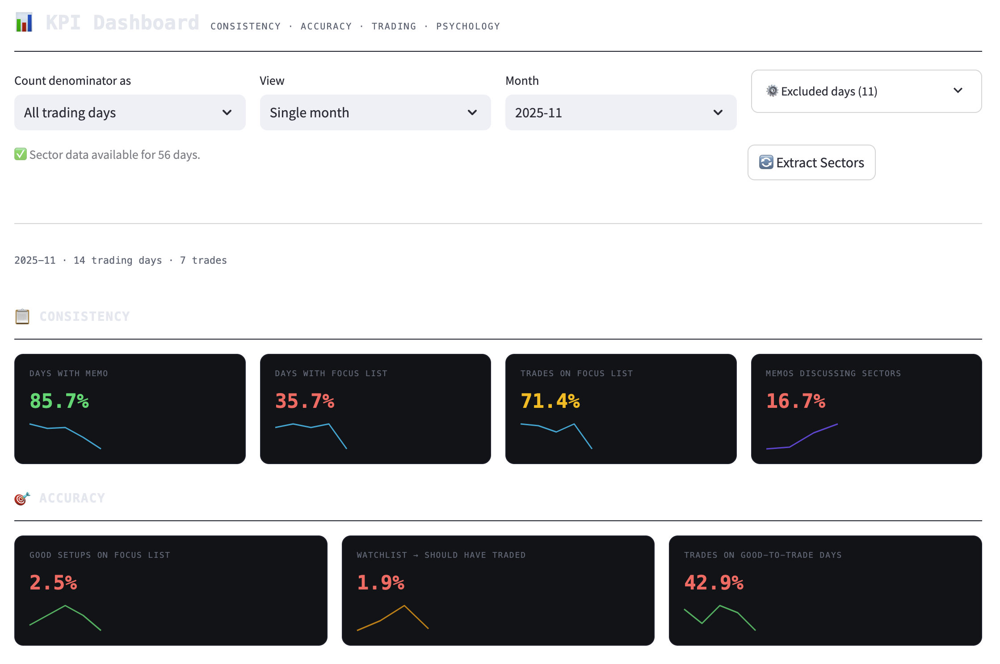
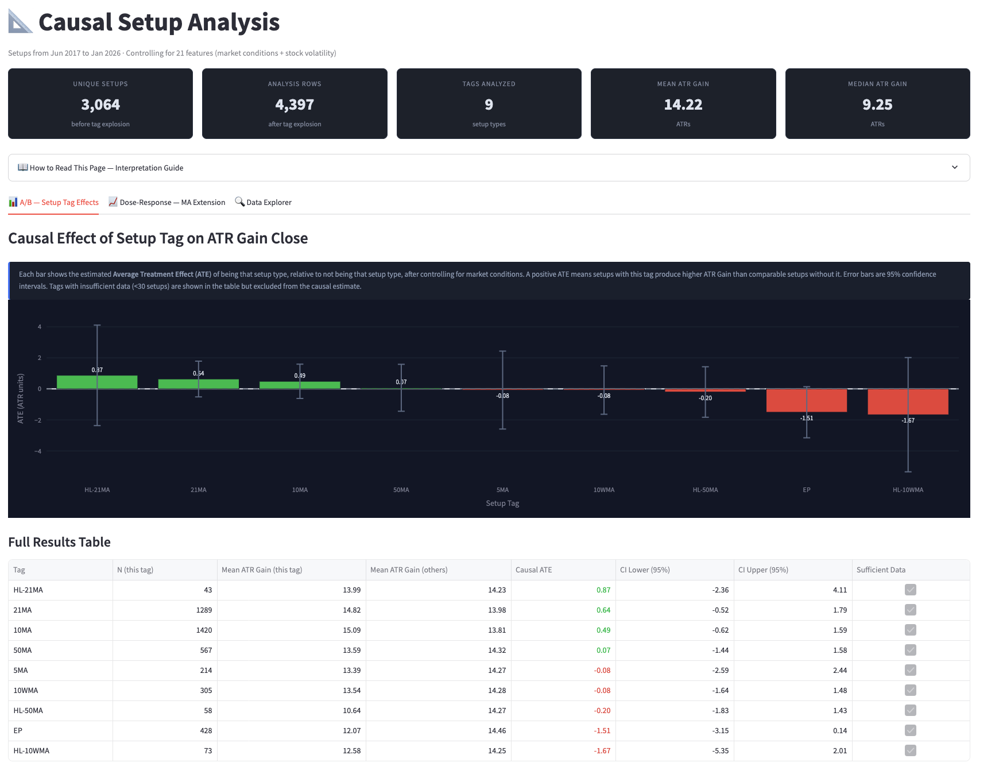
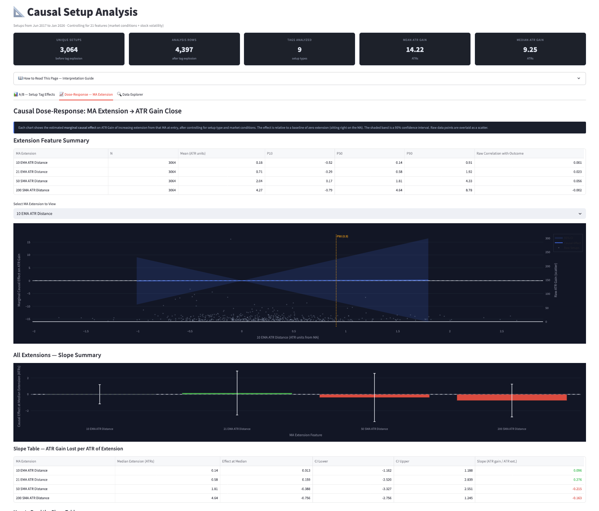
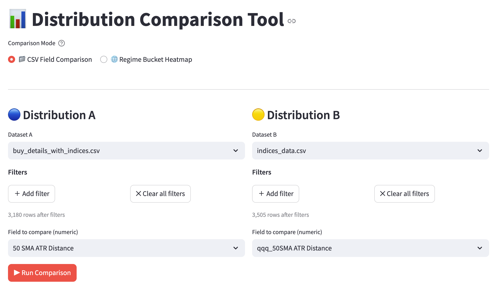
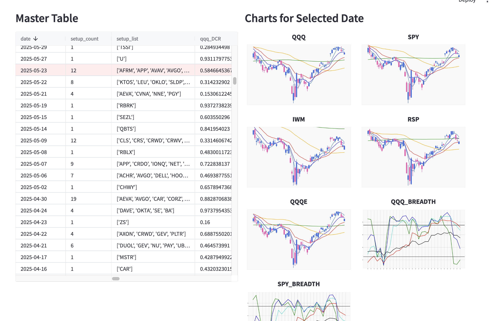

# Trading Journal & Edge Analysis System

A personal trading analytics platform built around how I actually work, not how trading education says you should. Covers the full loop: daily process tracking, behavioral self-analysis, historical edge analysis, and performance measurement.

> **Personal project, work in progress.** This is a tool I built for myself and continue to iterate on. Large parts of it work well and are in daily use; other parts are unfinished, undertested, or held together with duct tape. I may clean them up, or I may not. The bar is whether it works well enough for my purposes, not whether it is production-ready. Sharing it here as a reflection of how I think and build, rough edges included.

---

## Why I Built This

I couldn't find a single tool that did what I needed. Most traders keep journals in OneNote or Evernote. I knew that wasn't going to stick for me. I tried it and it didn't. What I *could* commit to was a voice memo. Talking through my market read and setups each morning takes two minutes and captures what I was actually thinking *at the moment of the decision*, not reconstructed from memory an hour later.

But a voice memo by itself is just audio. This app turns it into structured, queryable data, and from there into the kind of analysis that lets me make evidence-based decisions about my trading system.

The other thing I knew about myself: I'm lazy about building a setup library. Most traders do it with screenshots. I knew I'd never keep up with that, so I automated as much of it as I could. It's not perfect, but it's a system I'll actually use. That's the whole point.

**The core problem this solves** is a self-knowledge problem. Am I improving? Is my process consistent? Which setups actually have edge given the market environment I was trading in? Am I more likely to skip good trades when I'm in a certain emotional state? These questions require structured data over time, and nothing off-the-shelf was going to give me that for my specific setup and approach.

---

## What It Does

The platform has three distinct functions that work together:

**1. Daily process capture and behavioral analysis**
Voice memos are transcribed and structured automatically. The dashboard tracks whether I'm following my process consistently (memo recorded, focus list prepared, trades taken from the list), and an AI coaching layer compares what I said about trades I *took* vs. trades I *should have taken*, surfacing hesitation patterns, selection biases, and psychological tendencies I can't easily see myself.

**2. Historical edge analysis**
Once there's enough trade history, the statistical and causal analysis tools let me examine what's actually working. The Distribution Comparison tool lets me test whether my buy-point timing clusters at meaningfully different market conditions than the general population. The Causal Analysis page uses Double Machine Learning to estimate whether specific setup types have genuine edge after controlling for market regime, rather than raw correlation.

**3. KPI-based progress measurement**
Monthly scorecards across consistency, accuracy, trading, and psychology dimensions. The goal isn't to hit arbitrary thresholds. It's to have an honest, consistent signal of whether I'm getting better over time and where the weak points are.

---

## Technical Highlights

- **Voice-to-structured-data pipeline:** Whisper transcription → GPT-4o extraction into typed, queryable CSVs capturing sentiment, emotional state, per-ticker TIGERS scores, and sector themes
- **Double Machine Learning causal inference:** `econml` to estimate causal effect of setup characteristics on trade outcomes, controlling for market regime (not just raw correlation)
- **LLM behavioral coaching:** compares voice memo language on trades *taken* vs. trades *missed* at daily, monthly, and rollup time horizons
- **Custom KPI engine:** monthly metrics across four dimensions, scoped to real NYSE trading days via `exchange_calendars`, with configurable denominator filters
- **E\*Trade OAuth integration:** live portfolio data, LIFO trade matching, equity curve, real-time risk metrics
- **Statistical comparison tools:** KS test, Mann-Whitney U, ECDF, and regime bucket heatmaps for outcome distribution analysis
- **Full Streamlit app:** eleven-page dashboard wiring all of the above into a single interface

---

## System Architecture

```
Voice Memo (.m4a)  [macOS iCloud Recordings]
      │
      ▼
Whisper Transcription  (gpt-4o-mini-transcribe)
      │
      ▼
OpenAI Extraction ──► market_thoughts.csv   (sentiment, emotion, key themes)
                  └──► stock_thoughts.csv    (per-ticker TIGERS scores, raw thoughts)
                              │
                              ▼
                    Streamlit Dashboard
                    ├── Voice Analytics         transcript viewer, memo calendar
                    ├── Daily Curation          watchlist ingestion, focus list
                    ├── Annotations             trade + watchlist annotation
                    ├── Regime Analysis         outcome correlation by market condition
                    ├── Memo Analysis           AI behavioral coaching (took vs. missed)
                    ├── KPI Dashboard           monthly performance metrics
                    ├── Causal Analysis         Double ML setup effects
                    ├── Distribution Comparison statistical comparison tool
                    ├── ML Setup Clustering     unsupervised setup grouping
                    ├── Portfolio Analytics     equity curve, drawdown, win rate
                    └── Setup Gallery           chart image browser and tagger
```

<p>
  
  <br/>
  <em>App overview: sidebar navigation and landing page</em>
</p>

---

## Setup

**Requirements:** Python 3.8, macOS (voice memo pipeline reads from iCloud Recordings path, no Windows/Linux support)

```bash
pip install streamlit pandas openai plotly exchange-calendars pydub \
            econml scikit-learn numpy joblib pyarrow statsmodels \
            requests requests-oauthlib
```

> Do **not** install `pandas_market_calendars` as it forces a pandas downgrade. Use `exchange_calendars` directly instead.

### Directory Structure

```
trading_app/
├── data/
│   ├── raw_trades.csv
│   ├── watchlist_curation.csv
│   ├── master_df.csv
│   ├── master_journal.csv
│   ├── market_thoughts.csv
│   ├── stock_thoughts.csv
│   ├── indices_with_breadth.csv
│   ├── sector_themes.csv
│   ├── buy_details_with_indices.csv
│   ├── memo_analysis.json
│   ├── kpi_excluded_days.json
│   └── causal_cache/              ← auto-generated on first causal analysis run
├── pages/
│   ├── journal.py
│   ├── portfolio_page.py
│   ├── kpi_dashboard.py
│   └── causal_analysis.py
├── utils/
│   ├── config.py                  ← all credentials and constants
│   ├── etrade.py                  ← E*Trade OAuth + trade fetch logic
│   ├── data_manager.py
│   ├── kpi_page.py
│   ├── causal_engine.py
│   ├── memo_analysis.py
│   ├── regime_analysis.py
│   ├── trade_annotator.py
│   ├── voice_analytics.py
│   ├── watchlist_annotator.py
│   └── watchlist_curator.py
└── process_voice_memos.py         ← run outside Streamlit
```

### config.py

All credentials and app constants live here. This file is not committed.

```python
OPENAI_API_KEY      = "sk-..."

# E*Trade credentials
CONSUMER_KEY        = "..."
CONSUMER_SECRET     = "..."
ACCOUNT_ID_KEY      = "..."
BASE_URL            = "https://api.etrade.com"

# Portfolio risk thresholds
OPEN_HEAT_THRESHOLD = ...
NER_THRESHOLD       = ...

# Set after running calculate_starting_balance.py
STARTING_BALANCE    = ...
```

> **OpenAI costs:** The voice memo pipeline (Whisper + GPT-4o), Sector Extraction, and Memo Analysis all consume OpenAI tokens. A funded account with prepaid credits is required.

### Running the App

```bash
cd ~/Documents/trading_app
streamlit run pages/journal.py
```

---

## Daily Workflow

**Before market open:**
1. Record voice memo covering market outlook and stock setups
2. Run `process_voice_memos.py` to transcribe and extract structured data
3. Drop Focus List CSV into `data/watchlists/` and click **Run Ingest** in Daily Curation
4. Click **Rebuild Journal** to update `master_journal.csv`

**End of day / weekly:**
- Update trades via E\*Trade sync in Portfolio page
- Review and update annotations
- Run **Memo Analysis** monthly for behavioral coaching

---

## Voice Memo Pipeline

Run from terminal. Does not require Streamlit.

```bash
# Normal daily run (incremental — only processes new files)
python process_voice_memos.py

# Force full reprocessing
python process_voice_memos.py --force
```

**What it does:**
1. Detects new `.m4a` files in the iCloud Voice Memos Recordings folder
2. Copies to `data/audio/` and logs to `processed_files.csv`
3. Transcribes each file using OpenAI Whisper (`gpt-4o-mini-transcribe`)
4. Merges transcripts by date into `data/raw_transcripts.csv`
5. Extracts structured data via two prompts:
   - `PROMPT_MARKET` → `market_thoughts.csv`
   - `PROMPT_STOCKS` → `stock_thoughts.csv`
6. Runs bias analysis across full history → `market_bias_analysis.csv`, `stock_bias_analysis.csv`

Safe to run every day; skips dates already processed. Use `--force` only to re-run LLM extraction on existing transcripts.

---

## Dashboard Pages

### 🎙️ Voice Analytics
`journal.py → Voice Analytics`

- **Transcript viewer:** browse by date, shows raw transcript and extracted market/stock data
- **Memo calendar:** visual calendar of recording consistency, color-coded by presence; protocol score pip indicators
- **Coverage summary:** watchlist stocks not covered in memo; organic memo ideas (stocks discussed but not pre-watchlisted)
- **Ticker corrections:** flag low-confidence ticker extractions; corrections persist to `ticker_corrections.json` and feed into future prompt runs

<p>
  
  <br/>
  <em>Voice Analytics: transcript viewer and memo calendar</em>
</p>

---

### 📋 Daily Curation
`journal.py → Daily Curation`

| Tab | What it does |
|-----|-------------|
| Data Sync | Ingest Focus List CSVs from `data/watchlists/`; rebuild `master_journal.csv` |
| Memo Calendar | Monthly calendar with protocol score pips (0–3) and off-watchlist trade warnings |
| Ticker Corrections | Edit low-confidence ticker extractions; corrections injected into all future `PROMPT_STOCKS` runs |

<p>
  
  <br/>
  <em>Daily Curation: focus list ingest and memo calendar</em>
</p>

---

### ✏️ Annotations
`journal.py → Annotations`

**Watchlist Annotator**
- Editable table of `watchlist_curation.csv`
- Auto-populates `good_day_to_trade = True` when `master_df.setup_count >= 5`
- Auto-populates `should_have_traded = True` when the stock appears in `master_df.setup_list`
- Manual overrides tracked in `should_have_traded_manual`; never overwritten by auto-population

**Trade Annotator**
- Manual checkboxes per trade: `stop_5pct_would_have_won`, `stop_at_high_prevented_loss`, `panic_sold_too_early`
- `good_day_to_trade` auto-populated from `master_df` on the trade's `buy_date`
- Manual flags are preserved when trades are refreshed from E\*Trade

<p>
  
  <br/>
  <em>Annotations: watchlist annotator and trade annotator</em>
</p>

---

### 🌍 Regime Analysis
`journal.py → Regime Analysis`

Correlates trade outcomes and watchlist flags against market regime conditions from `indices_with_breadth.csv`.

**Regime dimensions:**
- **ATR distance:** how far the index is from its ATR-adjusted mean: Deeply OS / Slightly OS / Neutral / Slightly OB / Deeply OB
- **Streak z-score:** momentum streak strength: Very Low / Low / Below Avg / Above Avg / High / Very High

**Tabs:** Trade Annotations by Regime · Watchlist Flag by Regime · Combined Heatmap

<p>
  
  <br/>
  <em>Regime Analysis: combined regime heatmap</em>
</p>

---

### 🧠 Memo Analysis
`journal.py → Memo Analysis`

AI behavioral coaching comparing voice memo language on trades **taken** vs. trades **missed**.

**Three analysis layers:**

| Layer | Scope | What it analyzes |
|-------|-------|-----------------|
| Daily | Single trading day | Conviction language, hesitation, selection quality, key insight |
| Monthly | ~20 trading days | Recurring patterns, selection bias, psychological tendencies, top 3 recommendations |
| Rollup | All months | Cross-month trajectory, core psychological profile, priority focus areas |

Results saved to `data/memo_analysis.json` and preloaded on future visits. Re-run monthly.

<p>
  
  <br/>
  <em>Memo Analysis: monthly behavioral coaching summary</em>
</p>

---

### 📊 KPI Dashboard
`pages/kpi_dashboard.py`

Monthly self-evaluation across four dimensions. All denominators are built from real NYSE trading days only (weekends and holidays excluded via `exchange_calendars`). Manually excluded days (vacation, sick) are removed from denominators without affecting raw data.

**Day filter options** (scopes all KPI denominators):

| Filter | Description |
|--------|-------------|
| All trading days | Every NYSE session in the month (default) |
| Days traded on | Only days where at least one trade was taken |
| Days good to trade | Only days where `setup_count >= 5` |
| Days focus list exists | Only days where a watchlist was curated |
| Days with voice memo | Only days with a `market_thoughts.csv` entry |

**View modes:** Single month cards · All months table · Trend charts

<p>
  
  <br/>
  <em>KPI Dashboard: single month card view</em>
</p>

<p>
  
  <br/>
  <em>KPI Dashboard: trend charts across months</em>
</p>

---

### 📐 Causal Analysis
`pages/causal_analysis.py` · Engine: `utils/causal_engine.py`

Estimates the causal effect of setup characteristics on forward ATR Gain Close using **Double Machine Learning**, which controls for market regime before attributing outcome differences to the setup itself.

> **Important caveat:** All setups in the database cleared a ~15% gain threshold at curation. The analysis is conditional on success; it estimates how well setups work *given they already worked*, not whether they work. ATEs reflect heterogeneity in outcome quality, not win rate.

**Three tabs:**
- **A/B Setup Tag Effects:** ATE bar chart with 95% CI, SPY Regime Heatmap, violin distribution per tag
- **Dose-Response (MA Extension):** causal effect of MA extension at entry on forward gain; per-MA curves with slope summary table
- **Data Explorer:** filters, regime comparison tool, raw rows, regime distribution charts

Cache stored in `data/causal_cache/` as Parquet + JSON. First run takes several minutes; all subsequent loads are instant.

<p>
  
  <br/>
  <em>Causal Analysis: ATE bar chart with 95% CI by setup tag (Tab 1)</em>
</p>

<p>
  
  <br/>
  <em>Causal Analysis: MA extension dose-response curves (Tab 2)</em>
</p>

---

### 📊 Distribution Comparison Tool
`pages/distribution_comparison.py`

Two-mode statistical tool for comparing numeric distributions.

**Mode 1: CSV Field Comparison.** Compare any numeric field from any two CSVs in `data/`. Key use case: testing whether buy-point measurements cluster at statistically distinct values vs. the full population.

Output: side-by-side histograms, descriptive stats table, ECDF comparison, Delta ECDF.

**Mode 2: Regime Bucket Heatmap.** Compare ATR Gain Close between two custom-defined market regime slices. Requires causal cache.

**Statistical tests:**

| Test | Measures | Best for |
|------|----------|---------|
| KS Test | Overall shape difference | Catching tail differences the t-test misses |
| Mann-Whitney U | Rank-based tendency | Skewed data like ATR Gain |
| Welch t-test | Mean difference | Confirming mean shift when Mann-Whitney is significant |

<p>
  
  <br/>
  <em>Distribution Comparison: CSV field comparison with ECDF and stats table</em>
</p>

---

### Other Pages

| Page | Description |
|------|-------------|
| 🔬 ML Setup Clustering | Unsupervised clustering of setups by feature profile; discovers groupings that may not align with hand-assigned tags |
| 📈 Portfolio Analytics | Drawdown, win rate, expectancy, ATR-adjusted return metrics across trade history |
| 🖼️ Setup Gallery / Workflow | Chart image browser and tagger; source of labeled data used throughout the app |

<p>
  
  <br/>
  <em>Portfolio Analytics: equity curve and performance metrics</em>
</p>

<p>
  
  <br/>
  <em>Setup Gallery: chart image browser and tagger</em>
</p>

---

## KPI Metric Definitions

> A day is "good to trade" when `setup_count >= 5` in `master_df.csv`, indicating sufficient momentum setups to justify active trading. This definition is used consistently across all accuracy and psychology KPIs.

### Consistency

| KPI | Green | Definition |
|-----|-------|-----------|
| % Days with Memo | ≥ 80% | % of denominator days with a voice memo in `market_thoughts.csv` |
| % Days with Focus List | ≥ 80% | % of denominator days where `focus_list_exists = True` |
| % Trades on Focus List | ≥ 80% | % of trades where `(date, symbol)` appears in the watchlist for that date |
| % Memos Discussing Sectors | ≥ 60% | % of memo days with at least one bullish/bearish sector theme in `sector_themes.csv` |

### Accuracy

| KPI | Green | Definition |
|-----|-------|-----------|
| Setup Discovery Rate | ≥ 60% | Of all stocks in `master_df.setup_list` this month, % that also appeared on the focus list for the same date |
| % Watchlist → Should Have Traded | ≥ 30% | % of watchlist entries flagged `should_have_traded = True`; how actionable the focus list was in hindsight |
| % Trades on Good-to-Trade Days | ≥ 70% | % of trades entered on a day with `setup_count >= 5` |

### Trading

| KPI | Green | Definition |
|-----|-------|-----------|
| Win Rate | ≥ 55% | % of trades with `pct_return > 0` |
| Avg Win % | Positive | Mean `pct_return` on winning trades |
| Avg Loss % | Negative | Mean `pct_return` on losing trades (smaller magnitude is better) |

### Psychology

| KPI | Green | Definition |
|-----|-------|-----------|
| % Days Confident / Focused | ≥ 60% | % of memo days with `emotional_state` of "confident" or "focused" |
| % Trades on Confident Days | ≥ 60% | % of trades taken on days where emotional state was confident or focused |
| % Bullish Sentiment on Good Days | ≥ 60% | % of good-to-trade days where `market_sentiment = "bullish"`; tests alignment with opportunity |
| % Bearish/Neutral on Not-Good Days | ≥ 50% | % of non-good-to-trade days where sentiment was "bearish" or "neutral"; tests appropriate caution |

---

## E*Trade Integration

`utils/etrade.py` handles all brokerage connectivity via OAuth 1.0a.

**In-app authentication flow (once per session):**
1. Click **Start E\*Trade Login** on the Portfolio page
2. Click the generated link → authorize in browser
3. Copy the verifier PIN → paste into app
4. Session is stored in `st.session_state`; re-authorization required on each app restart

**Trade data pipeline:**
- `get_all_trades()`: fetches full transaction history via paginated E\*Trade API
- `match_lifo_trades()`: matches buys to sells using LIFO cost basis
- `aggregate_trades_by_buy()`: consolidates partial fills into single trade records with weighted avg price, total gain, `pct_return`, `avg_days_in_trade`
- `calculate_monthly_metrics()`: per-month win rate, avg gain/loss, biggest win/loss

Manual trade annotations (stop flags, panic sell flags, etc.) are preserved across E\*Trade syncs via `merge_annotations()` in `utils/trade_annotator.py`.

---

## Data Files Reference

| File | Updated by | Key columns |
|------|-----------|-------------|
| `raw_trades.csv` | E\*Trade sync (Portfolio page) | `symbol, buy_date, buy_price, quantity, gain, pct_return` |
| `watchlist_curation.csv` | Focus list ingest + Annotator | `date, stock, focus_list_exists, setup_type, conviction, should_have_traded, good_day_to_trade` |
| `master_df.csv` | External screener script | `date, setup_count, setup_list` |
| `master_journal.csv` | Rebuild Journal button | Joined view of all sources |
| `market_thoughts.csv` | Voice memo pipeline | `date, market_sentiment, emotional_state, emotional_intensity, influences, key_themes, raw_transcript` |
| `stock_thoughts.csv` | Voice memo pipeline | `date, stock, raw_thoughts, summarized_thoughts, Tightness, Ignition, Group, Earnings, RS, ticker_confidence` |
| `indices_with_breadth.csv` | External screener script | `date` + ATR/EMA/breadth metrics per index |
| `sector_themes.csv` | Extract Sectors button (KPI page) | `date, bullish, bearish` |
| `buy_details_with_indices.csv` | External (causal analysis input) | Setup entries with regime columns for Double ML |
| `memo_analysis.json` | Run Analysis button (Memo Analysis) | Daily/monthly/rollup analysis results |
| `kpi_excluded_days.json` | KPI exclusion calendar | List of `YYYY-MM-DD` strings |

---

## TIGERS Framework

A five-factor setup quality scoring system extracted automatically from voice memo transcripts.

| Factor | What it captures | Example language |
|--------|-----------------|-----------------|
| **T: Tightness** | Consolidation, low volatility, controlled action | tight, VCP, coiling, compressed, basing |
| **I: Ignition** | Breakout or momentum catalyst | breakout, surging, volume spike, clearing resistance |
| **G: Group** | Sector or peer group acting well | sector moving, peers acting, whole group |
| **E: Earnings** | Fundamental quality or recent results | EPS growth, revenue beat, guidance raised |
| **R: RS** | Relative strength vs. market | holding up, outperforming, RS line, leading |

TIGERS score = count of populated factors (0–5). Score of 4–5 = high conviction setup.

Used in Memo Analysis (comparing took vs. missed TIGERS profiles), stock thoughts viewer, and master journal.

---

## Implementation Notes

- **Python 3.8 compatibility:** uses `Union`/`Optional` from `typing`, no `match` statements, no f-string backslashes, no lowercase generics
- **pandas 2.0.3:** `exchange_calendars` used directly; `pandas_market_calendars` causes a downgrade
- **`_is_true()`:** handles mixed-type boolean columns (`True`, `'True'`, `'1'`, `NaN`, `None`) consistently across all watchlist flag checks
- **`_parse_setup_list()`:** robustly parses `setup_list` values in format `['ASTS', 'FLNC']`, stripping brackets, quotes, and whitespace
- **NYSE holiday cache:** `_NYSE_HOLIDAY_CACHE` prevents repeated `exchange_calendars` calls for the same date range within a session
- **Sector extraction:** the Extract Sectors button triggers a GPT-4o batch job over `market_thoughts.csv`; results are appended incrementally so the process can be re-run without reprocessing historical data

---

*Personal project, not intended for general use. Built and maintained for my own trading practice.*
